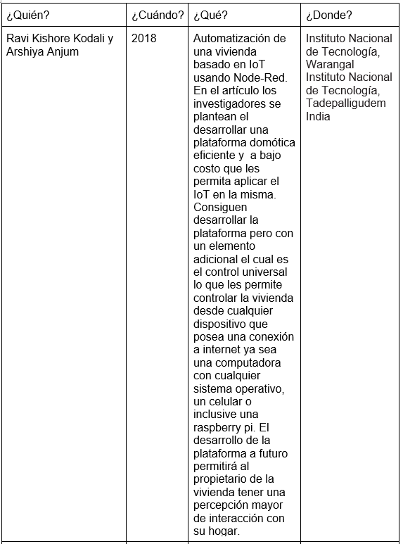
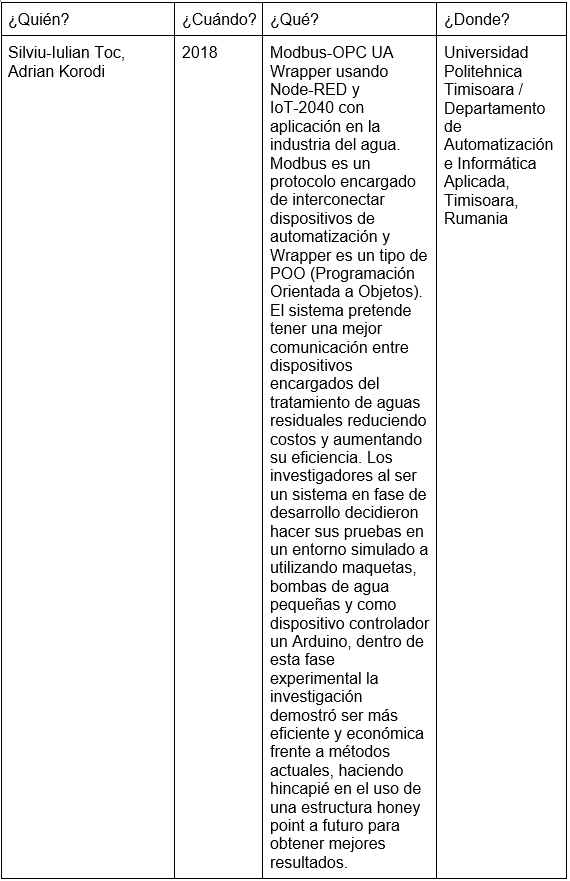
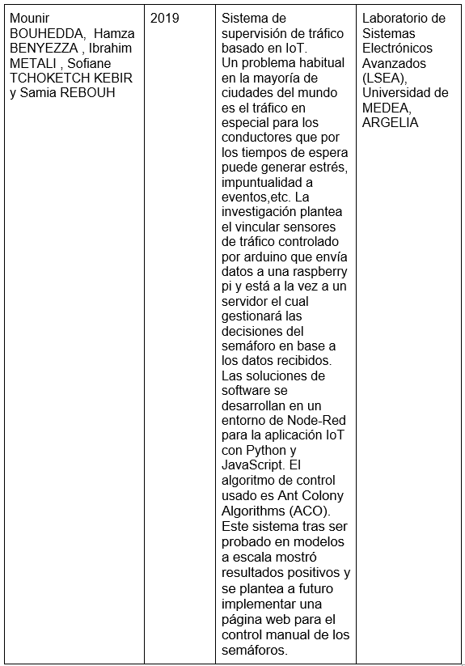
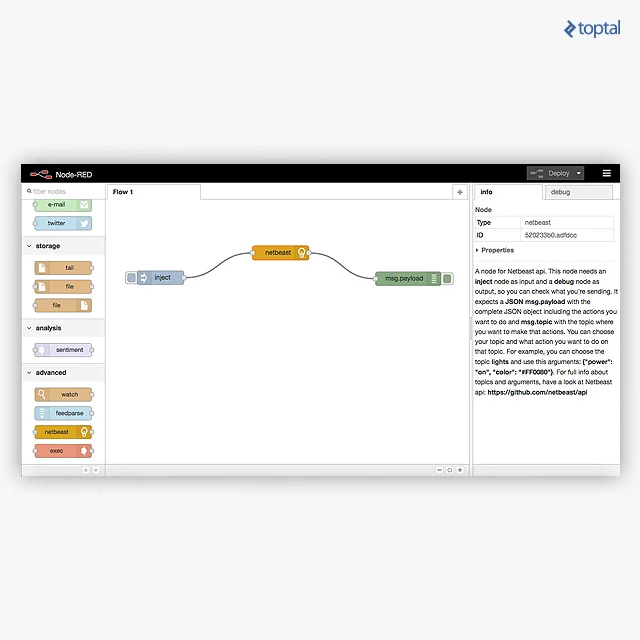
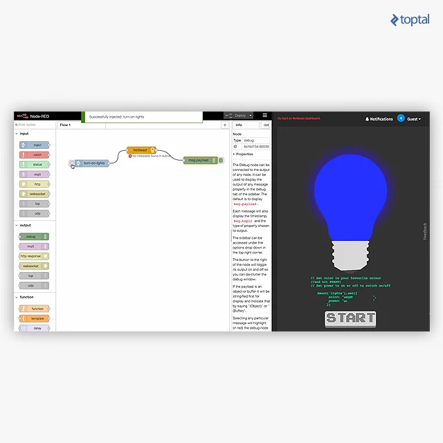

# NODE-RED

## 1. PLANTEAMIENTO DEL PROBLEMA
Investigación acerca de  Node-Red características principales, nodos fundamentales y usos como una herramienta de programación visual para aplicaciones básicas, a realizarse por parte de los estudiantes de segundo año de Tic´s de la Universidad de las Fuerzas armadas “Espe” en el año 2020

## 2. OBJETIVOS
### **General**
- Analizar la aplicación Node-Red, sus características y los usos que tiene en el campo de la Informática y Programación.
### **Específicos**
- Identificar los tipos de Nodos Fundamentales de Node-Red y sus aplicaciones específicas.
- Adquirir nociones básicas del lenguaje esamblador (asm).
- Desarrollar ejemplos prácticos con los Nodos de tipo Adicional, Central y de Almacenamiento.
- Indicar la manera correcta de instalación de Node-Red en un computador.

## 3. ESTADO DEL ARTE

## 4. MARCO TEORIÓCO 
Para poder fomentar bien las bases de nuestra investigación debemos aclarar específicamente las dudas de conocimiento que se tenga sobre el mismo, y sobre lo que se va a trabajar, para lo cual vamos a tomar como punto de partida una vista rápida a los fundamentos de Node-Red los cuales nos serán útiles para ubicarnos dentro de la herramienta.

#### Fundamentos necesarios de Node- RED
Para obviar temas como la historia de Node- RED, se pondrá únicamente datos puntuales que nos ayuden con nuestra investigación.

- Node red es una herramienta de programación visual basada en flujos.

- Dichos flujos describen el comportamiento de nodos.

- Cada nodo recibe y captura datos específicos, los cuales están enlazados a otros nodos que realizan funciones diferentes.

- No es necesario bajar al nivel de detalle de código en cada nodo.

Una vez que conocemos los datos básicos podemos abrirnos paso para investigar más a fondo la instalación de sus respectivos nodos con sus diferentes funciones o apartados.

#### Instalación de nodos y tipos de nodos
Node RED al ser una herramienta de programación visual nos despliega un barra donde podemos encontrar diversos tipos de nodos, pero no siempre van a venir pre cargados en el sistema, para lo cual debemos instalar librerías que nos proporcionen los tipos de modos que vayamos a utilizar para esto Node Red cuenta con la opción de instalar en  “manage palette”.
Si queremos usar nodos centrales, adicionales o de almacenamiento, debemos entender el flujo que necesita cada nodo para poder implementarlo y debemos conocer cada uno de ellos y cuáles son sus funciones dentro del marco teórico.

#### Nodos centrales
Los nodos centrales pueden tomar diversas ocupaciones dependiendo de la función general que se quiera implementar, pero se debe saber que aquel al que llamaremos nodo central es el que carga con la parte principal del trabajo dentro de la red de nodos, y si este por alguna razón x o y presenta una dificultad el programa no podrá funcionar en su totalidad.
También se ha encontrado que se puede llamar nodos centrales a los “Core nodes” que son: Inject, Function, Change, Debug, Switch, Template.

#### Nodos adicionales

Dentro de la categoría de nodos adicionales, tenemos una infinidad de tipos y diversidad de funciones, que servirán como un plus para nuestro programa, ya que sin estos nodos el programa base si puede funcionar sin ningún problema.

#### Node-Red en el internet de las cosas
Una vez que se tiene claro los fundamentos teóricos y  el funcionamiento de los tipos de nodos con los que vamos a trabajar, es necesario saber en qué campos podemos trabajar los diversos ejemplos que hagamos dentro de Node-Red y nos encontramos con lo que se hace con frecuencia hoy en día con los programas, que es orientarlo al internet de las cosas, con su particularidad, la cual por lo general es facilitar las cosas a un consumidor por medio de internet, además que logra incluir problemas o acciones que nos rodean en el diario vivir las cuales podemos implementar en Node-Red usándolo como nuestra plataforma para el internet de las cosas.  
Siendo así que podemos basar nuestras aportaciones en muchos de los ejemplos que existen de Note-Red en el internet de las cosas. 

## 5.Diagramas 
Automatización de las luces de una casa por nodos
En la siguiente imagen podemos ver que las imágenes con la notificación en amarillo son las que están ejecutando pero no se puede encontrar ningún dispositivo para que el dispositivo aparezca debe estar conectado a la misma red.

Después tenemos que realizar un flujo simple  en el cual primero estar en forma de nodo de inyección de segundo se encuentra el nodo netBeast este segundo nod se encontrara en modo de depuración.

