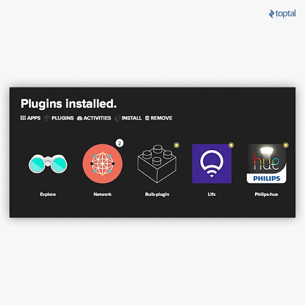
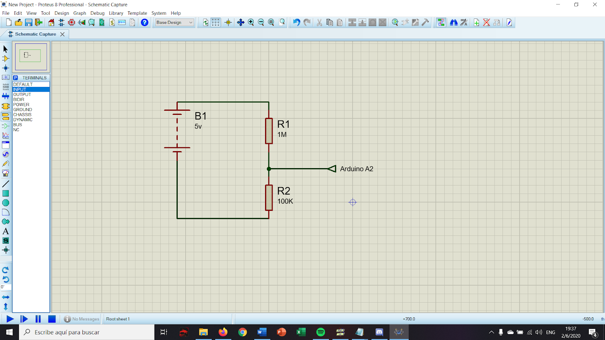
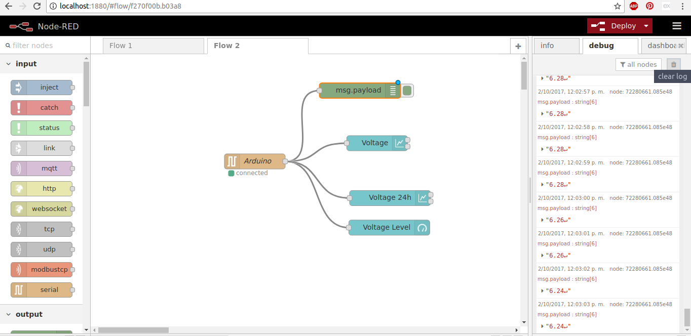
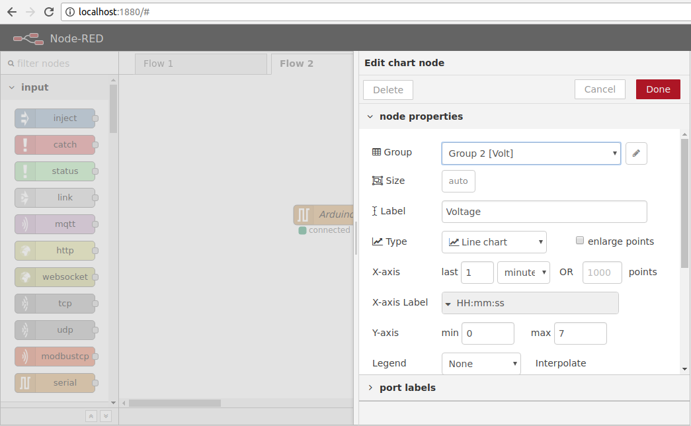
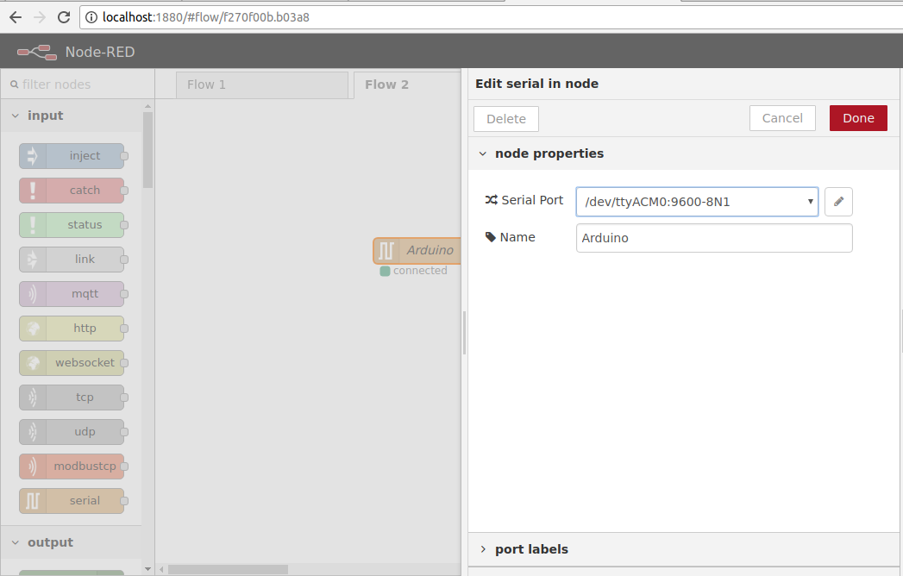
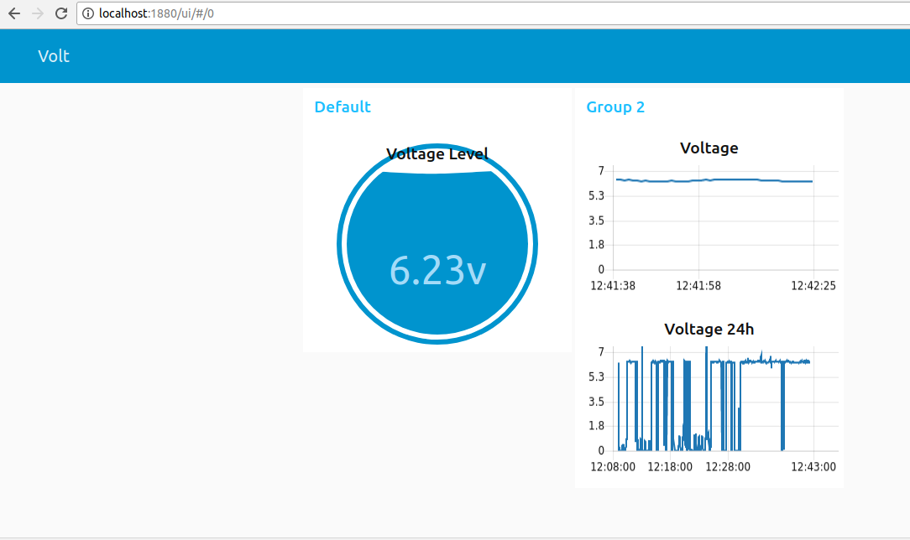
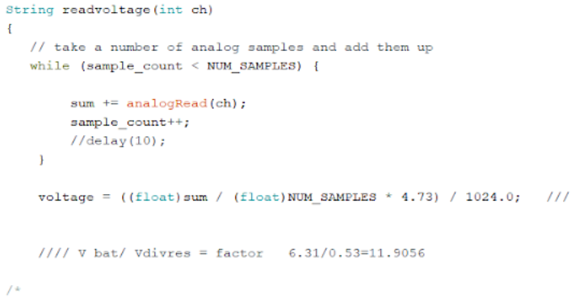
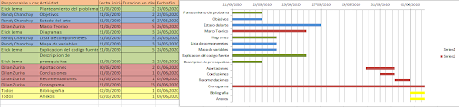

# NODE-RED

## 1. PLANTEAMIENTO DEL PROBLEMA
Investigación acerca de  Node-Red características principales, nodos fundamentales y usos como una herramienta de programación visual para aplicaciones básicas, a realizarse por parte de los estudiantes de segundo año de Tic´s de la Universidad de las Fuerzas armadas “Espe” en el año 2020

## 2. OBJETIVOS
### **General**
- Analizar la aplicación Node-Red, sus características y los usos que tiene en el campo de la Informática y Programación.
### **Específicos**
- Identificar los tipos de Nodos Fundamentales de Node-Red y sus aplicaciones específicas.
- Adquirir nociones básicas del lenguaje esamblador (asm).
- Desarrollar ejemplos prácticos con los Nodos de tipo Adicional, Central y de Almacenamiento.
- Indicar la manera correcta de instalación de Node-Red en un computador.

## 3. ESTADO DEL ARTE

## 4. MARCO TEORIÓCO 
Para poder fomentar bien las bases de nuestra investigación debemos aclarar específicamente las dudas de conocimiento que se tenga sobre el mismo, y sobre lo que se va a trabajar, para lo cual vamos a tomar como punto de partida una vista rápida a los fundamentos de Node-Red los cuales nos serán útiles para ubicarnos dentro de la herramienta.

#### Fundamentos necesarios de Node- RED
Para obviar temas como la historia de Node- RED, se pondrá únicamente datos puntuales que nos ayuden con nuestra investigación.

- Node red es una herramienta de programación visual basada en flujos.

- Dichos flujos describen el comportamiento de nodos.

- Cada nodo recibe y captura datos específicos, los cuales están enlazados a otros nodos que realizan funciones diferentes.

- No es necesario bajar al nivel de detalle de código en cada nodo.

Una vez que conocemos los datos básicos podemos abrirnos paso para investigar más a fondo la instalación de sus respectivos nodos con sus diferentes funciones o apartados.

#### Instalación de nodos y tipos de nodos
Node RED al ser una herramienta de programación visual nos despliega un barra donde podemos encontrar diversos tipos de nodos, pero no siempre van a venir pre cargados en el sistema, para lo cual debemos instalar librerías que nos proporcionen los tipos de modos que vayamos a utilizar para esto Node Red cuenta con la opción de instalar en  “manage palette”.
Si queremos usar nodos centrales, adicionales o de almacenamiento, debemos entender el flujo que necesita cada nodo para poder implementarlo y debemos conocer cada uno de ellos y cuáles son sus funciones dentro del marco teórico.

#### Nodos centrales
Los nodos centrales pueden tomar diversas ocupaciones dependiendo de la función general que se quiera implementar, pero se debe saber que aquel al que llamaremos nodo central es el que carga con la parte principal del trabajo dentro de la red de nodos, y si este por alguna razón x o y presenta una dificultad el programa no podrá funcionar en su totalidad.
También se ha encontrado que se puede llamar nodos centrales a los “Core nodes” que son: Inject, Function, Change, Debug, Switch, Template.

#### Nodos adicionales

Dentro de la categoría de nodos adicionales, tenemos una infinidad de tipos y diversidad de funciones, que servirán como un plus para nuestro programa, ya que sin estos nodos el programa base si puede funcionar sin ningún problema.

#### Node-Red en el internet de las cosas
Una vez que se tiene claro los fundamentos teóricos y  el funcionamiento de los tipos de nodos con los que vamos a trabajar, es necesario saber en qué campos podemos trabajar los diversos ejemplos que hagamos dentro de Node-Red y nos encontramos con lo que se hace con frecuencia hoy en día con los programas, que es orientarlo al internet de las cosas, con su particularidad, la cual por lo general es facilitar las cosas a un consumidor por medio de internet, además que logra incluir problemas o acciones que nos rodean en el diario vivir las cuales podemos implementar en Node-Red usándolo como nuestra plataforma para el internet de las cosas.  
Siendo así que podemos basar nuestras aportaciones en muchos de los ejemplos que existen de Note-Red en el internet de las cosas. 

## 5. Diagramas 
Automatización de las luces de una casa por nodos
En la siguiente imagen podemos ver que las imágenes con la notificación en amarillo son las que están ejecutando pero no se puede encontrar ningún dispositivo para que el dispositivo aparezca debe estar conectado a la misma red.

Después tenemos que realizar un flujo simple  en el cual primero estar en forma de nodo de inyección de segundo se encuentra el nodo netBeast este segundo nod se encontrara en modo de depuración.
Y al final solo se enlazan los 3 nodos en un flujo simple como en la siguiente imagen.

## 6. Lista de Componentes
- Dispositivo de 32 o 64 bits.
- Programa Node.js

## 7. Codigo Fuente
Node-Red se basa en Node.js. Para instalar el Node-Red, necesitas tener tanto Node.js instalado como NPM. Con NPM, es muy fácil instalar. Debemos acceder al common pront de Node.js y digitar:
- npm install -g node-red
El editor de flujo de Node-Red es una aplicación basada en navegadores web. Para poder utilizarlo, ejecuta Node-Red en el common pront:
- node-red

## 8. Descripción de Prerrequisitos y configuración.
Esto puede depender del proyecto que se vaya a poner en marcha con node-red se necesita Windows 7/8/10 de (32 o 64 bits), Mac OS o incluso se la podemos instalar en una raspberry pi claro que dependiendo el hardware en el cual se corre node-red tendrá diferentes limitaciones o problemas de compatibilidad que se pueden solucionar con la intalacion de diferentes drivers faltantes.

## 9. Aportaciones
###  Voltimetro en la pantalla de tu computadora
#### Materiales:
- 1 Resistencia 1MOhm.
- 1 Resistencia 100K
- 1 Multímetro
- 1 Arduino
- 1 Protoboard
- 1 Fuente de poder

#### Funcionamiento
Un microcontrolador como lo es el arduino trabaja con voltajes entre 0v-5v, con pines de entrada y salida. En sus pines de entrada cuenta con entradas analogicas que nos permiten medir valores que variables siempre y cuando sean pequeños. Por este motivo si queremos realizar un voltímetro usaremos estas entradas.
Las entradas análogas en caso de un sobrevoltaje pueden ocasionar da;os en nuestro arduino por lo que debemos disminuir el valor de entrada del voltaje mediante un divisor de voltaje.

- **Nota:** Respetar polaridad de la fuente de voltaje.
#### Los nodos a utilizar son:
- Nodo de puertos Seriales, estos permitirán la comunicación punto a punto vía serial Arduino PC(Node-RED).
- Nodos de Node-RED Dashboard, Permite una variedad de nodos Widgets para crear visualizaciones espectaculares.

Configuración Nodo chart (Node-RED Dashboard)

Con unas pocas configuraciones podemos crear una gráfica para visualizar en nuestros datos.

#### Configuración Nodo Serial Port (Puerto serial)
Vinculamos el puerto serial a usar para conectar nuestro dispositivo y nuestro arduino

#### Node-RED Dashboard
Utilizaremos los nodos Dashboard para ser más específicos los widgets Chart y Gauge que nos permiten visualizar la gráfica en tiempo real de los voltajes medidos.

#### Código de Arduino
Nuestro código va a tomar 10 muestras de los valores de voltaje ingresado dividido por el divisor de voltaje, entonces mediante la calibración debemos determinar los valores óptimos para que concuerde la medición de un voltímetro real y nuestro código.

## 10. Conclusiones
El análisis y dedicación correspondiente que se le dio a nuestra investigación nos arroja como conclusiones que la herramienta Node-RED es de gran utilidad y brinda grandes bondades hasta para aquellos usuarios que no poseen un amplio conocimiento de programación, debido a que la instalación  e implementación de sus nodos por medio de la programación orientada a objetos resulta ser bastante amigable con la comunidad que quiere empezar en este medio, sin embargo al momento de profundizar e ir por proyectos más complejos nos topamos con una herramienta bastante completa que demanda el conocer diferentes apartados de la misma para poder llevar a cabo programas más grandes.

También podemos concluir que Node-RED tiene gran influencia en lo que hoy en dia llamamos “el internet de las cosas” ya que existe una infinidad de proyectos que nos ayudan a optimizar nuestro entorno cotidiano, ya sea facilitando una acción o personalizándola a nuestro gusto, lo que nos demuestra que esta herramienta de programación ha logrado su objetivo en la comunidad.

## 11. Recomendaciones
Son pocas las recomendaciones que se puede dar sobre esta herramienta ya que se apoya con gran eficacia en su página web donde se puede encontrar varios apartados para la ayuda y guía de quien lo necesite. Sin embargo se puede rescatar unas pocas recomendaciones tal como:
- El tema de los comandos, ya que resulta tedioso en diferentes apartados como la instalación, y también en la configuración del host, esto se debe a que Note-RED usa comandos propios, por lo cual se recomienda empaparse muy bien en lo que a comandos de la herramienta respecta.
- Otra recomendación que se puede dar es la de descargar al menos 3 librerias, ya que la herramienta como tal carece de variedad de nodos.

## 12. Cronograma

## 13. Bibliografía

#### References
Bouhedda, M., Benyezza, H., Metali, I., Kebir, S. T., & Rebouh, S. (2019). Traffic Intersection Fuzzy Control and Supervision System based on IoT. 2019 International Conference on Applied Automation and Industrial Diagnostics (ICAAID). doi:10.1109/icaaid.2019.8934994

Kodali, R. K., & Anjum, A. (2018). IoT Based HOME AUTOMATION Using Node-RED. 2018 Second International Conference on Green Computing and Internet of Things (ICGCIoT). doi:10.1109/icgciot.2018.8753085

Toc, S., & Korodi, A. (2018). Modbus-OPC UA Wrapper Using Node-RED and IoT-2040 with Application in the Water Industry. 2018 IEEE 16th International Symposium on Intelligent Systems and Informatics (SISY). doi:10.1109/sisy.2018.8524749

Developers, Jesus Dario,2016, Programación Visual con Node-Red: Conectando el Internet de las Cosas con Facilidad, recopilado de: https://www.toptal.com/nodejs/programacion-visual-con-node-red-conectando-el-internet-de-las-cosas-con-facilidad#:~:text=En%20Node%2DRED%2C%20cada%20nodo,realizan%20alg%C3%BAn%20trabajo%20en%20%C3%A9l.

Techedge, Rhino Node-RED,Pablo Sancho, 2020, recopilado de: https://www.techedgegroup.com/es/blog/fundamenos-node-red

Node-RED, Running on Raspberry Pi y Adding nodes to the palette,recopilado de: https://nodered.org/docs/user-guide/runtime/adding-nodes y https://nodered.org/docs/getting-started/raspberrypi

## 14.1. Manual del Usuario
Para la instalación de la herramienta (en Raspberry Pi) y los nodos correspondientes.

#### Instalación de la Herramienta

**Nota:** Se debe tomar en cuenta los prerrequisitos para Raspberry Pi

**1.** Proporcionamos un script para instalar Node.js, npm y Node-RED en una Raspberry Pi. El script también se puede usar para actualizar una instalación existente cuando hay una nueva versión disponible.
Ejecutar el siguiente comando descargará y ejecutará el script. Este script funcionará en cualquier sistema operativo basado en Debian, incluidos Ubuntu y Diet-Pi. Es posible que primero deba ejecutar sudo apt install build-essential git para asegurarse de que npm pueda construir cualquier módulo binario que necesite instalar.

**2.** Uso de comandos para correr Node-RED
Corriendo localmente, al igual que al ejecutar Node-RED localmente, puede usar el comando node-red para ejecutar Node-RED en una terminal. Luego se puede detener presionando Ctrl-C o cerrando la ventana de terminal.
Debido a la memoria limitada de Raspberry Pi, deberá iniciar Node-RED con un argumento adicional para indicarle al proceso Node.js subyacente que libere memoria no utilizada antes de lo que lo haría de otra manera.
Para hacer esto, debe usar el comando alternativo node-red-pi y pasar el argumento max-old-space-size.

**3.** Correr como un servicio
El script de instalación para Pi también lo configura para ejecutarse como un servicio. Esto significa que puede ejecutarse en segundo plano y habilitarse para iniciarse automáticamente en el arranque.
Los siguientes comandos se proporcionan para trabajar con el servicio:
- node-red-start: inicia el servicio Node-RED y muestra su salida de registro. Al presionar Ctrl-C o cerrar la ventana no se detiene el servicio; sigue funcionando en segundo plano.
- node-red-stop: esto detiene el servicio Node-RED
- node-red-restart - esto detiene y reinicia el servicio Node-RED
- node-red-log: muestra la salida del registro del servicio

También puede iniciar el servicio Node-RED en el escritorio de Raspbian seleccionando la opción Menú -> Programación -> Nodo-RED.

**4.** Inicio automático en el arranque
Si desea que Node-RED se ejecute cuando el Pi se enciende o se reinicia, puede habilitar el servicio para que se inicie automáticamente ejecutando el comando:
sudo systemctl enable nodered.service
- Agregar Nodos a la paleta
Node-RED viene con un conjunto básico de nodos útiles, pero hay muchos más disponibles tanto del proyecto Node-RED como de la comunidad en general.

Puede buscar nodos disponibles en la biblioteca Node-RED.

**1.** Usando el editor puede instalar nodos directamente dentro del editor seleccionando la opción Administrar paleta en el menú principal para abrir el Administrador de paletas.

**2.** La pestaña "Nodos" enumera todos los módulos que ha instalado. Muestra qué está utilizando y si hay actualizaciones disponibles para alguno de ellos.

**3.** La pestaña "Instalar" le permite buscar en el catálogo de módulos de nodo disponibles e instalarlos.

**4.** Instalando con npm, para instalar un módulo de nodo desde la línea de comandos, puede usar el siguiente comando desde su directorio de datos de usuario

**5.** Luego deberá reiniciar Node-RED para que pueda recoger los nuevos nodos.
Las versiones recientes de npm agregarán automáticamente el módulo a la sección de dependencias del archivo package.json en su directorio de usuario.

**Nota:**  Durante el desarrollo también es posible instalar nodos copiando sus archivos .js y .html en un directorio de nodos dentro de su directorio de datos de usuario. Si estos nodos tienen dependencias npm, también deben instalarse dentro del directorio de datos del usuario. Esto solo se recomienda realmente para fines de desarrollo.

